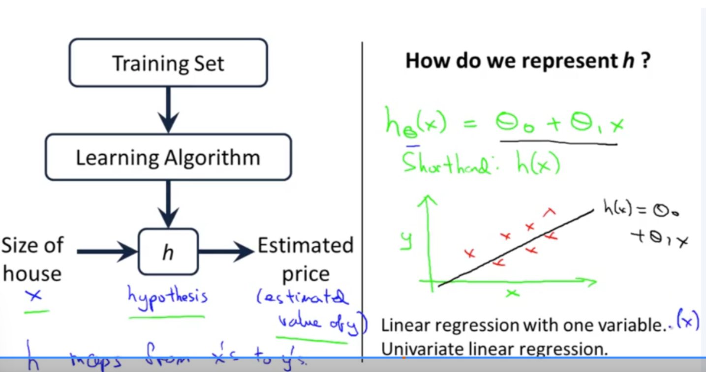

### 🧠 What is Model Representation in Machine Learning?

**Model representation** refers to the mathematical way in which a machine learning algorithm maps **input data (features)** to **output predictions (labels or values)**. It's how we describe the **form or structure** of the model we are using.

---

### 📐 Why It Matters:

Before training begins, you must choose a model representation — that is, how your algorithm will **learn patterns** and **make predictions**. This forms the foundation of your learning system.

---

### 📊 Examples of Model Representation

#### ✅ 1. **Linear Regression (for regression problems)**

**Use Case:** Predict house prices based on size.

**Model Representation:**

$$
h(x) = \theta_0 + \theta_1 x
$$

* $h(x)$ = predicted price
* $x$ = size of the house
* $\theta_0$, $\theta_1$ = parameters learned from training

**Example:**

| House Size (sqft) | Price (\$K) |
| ----------------- | ----------- |
| 1000              | 150         |
| 1500              | 200         |

The algorithm finds $\theta_0$, $\theta_1$ such that the line fits this data well.

---

#### ✅ 2. **Logistic Regression (for classification problems)**

**Use Case:** Predict whether an email is spam.

**Model Representation:**

$$
h(x) = \frac{1}{1 + e^{-(\theta_0 + \theta_1 x)}}
$$

* Output $h(x) \in (0, 1)$, interpreted as probability
* If $h(x) > 0.5$, classify as "spam"; else "not spam"

---

#### ✅ 3. **Decision Tree**

**Use Case:** Predict loan approval based on income and credit score.

**Model Representation:**

A **tree structure** where:

* Each **internal node** = a feature and decision (e.g. "income > \$50k?")
* Each **leaf node** = prediction (e.g. "Approve" or "Deny")

```
         Income > 50k?
           /       \
        Yes         No
       /             \
   Credit > 700?     Deny
    /     \
 Approve  Deny
```

---

#### ✅ 4. **Neural Network**

**Use Case:** Image classification (e.g., cat vs. dog)

**Model Representation:**

A **network of neurons** with layers, where each neuron applies:

$$
z = \sum w_ix_i + b,\quad a = \text{activation}(z)
$$

* Input layer → hidden layers → output layer
* Weights and biases $w_i, b$ are learned
* Activation functions like ReLU or sigmoid introduce non-linearity

---

### 📌 Summary Table

| Algorithm           | Model Representation               | Suitable For                        |
| ------------------- | ---------------------------------- | ----------------------------------- |
| Linear Regression   | $h(x) = \theta_0 + \theta_1 x$     | Predicting continuous values        |
| Logistic Regression | $h(x) = \frac{1}{1 + e^{-z}}$      | Binary classification               |
| Decision Tree       | Feature-based tree structure       | Both classification & regression    |
| Neural Network      | Layers of neurons with activations | Complex problems (e.g. vision, NLP) |

---



This image explains the **model representation** in **univariate linear regression** — a foundational concept in supervised machine learning.

---

### 🧠 **What’s Being Illustrated**

#### 🔄 Left Side: The Learning Process

* **Training Set:** A dataset containing pairs of input (e.g. house sizes) and output (e.g. prices).
* **Learning Algorithm:** Takes the training set and produces a **hypothesis function** $h$, also called the **model**.
* **$x$:** The **input feature**, in this case, the size of the house.
* **$h(x)$:** The **hypothesis** or prediction function, which gives an **estimated price** for a given house size.
* **Output:** An estimated value $y$, predicted by the model.

> **Bottom note:**
> “$h$ maps from $x$'s to $y$'s”
> This means the hypothesis function takes input values $x$ and produces output predictions $y$.

---

#### 🧮 Right Side: Representing the Hypothesis Function

* The function is written as:

  $$
  h_\theta(x) = \theta_0 + \theta_1 x
  $$

  where:

  * $\theta_0$ = intercept (bias)
  * $\theta_1$ = slope (weight of the feature)

* **Shorthand notation:** Often just written as $h(x)$

* **Graph:**

  * X-axis: Size of house (feature $x$)
  * Y-axis: Price (prediction $y$)
  * Red crosses: Actual training examples
  * Black line: Linear model learned by the algorithm

---

### 📌 Summary

| Term                 | Meaning                                               |
| -------------------- | ----------------------------------------------------- |
| $x$                  | Input feature (e.g. house size)                       |
| $y$                  | Output label (e.g. house price)                       |
| $h(x)$               | Hypothesis function (model)                           |
| $\theta_0, \theta_1$ | Model parameters learned from data                    |
| Goal                 | Minimize the difference between $h(x)$ and actual $y$ |

---
