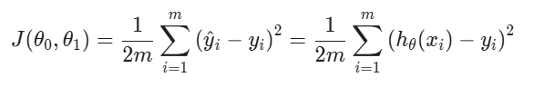

# 💰 **Cost Function in Machine Learning**

The **cost function** measures how well our **hypothesis function** $h_\theta(x)$ predicts the actual outcomes $y$. It's a way to quantify the **error** between predicted and actual values.

---

### 🧮 **Cost Function Formula (for Linear Regression)**

$$
J(\theta_0, \theta_1) = \frac{1}{2m} \sum_{i=1}^{m} \left( h_\theta(x_i) - y_i \right)^2
$$

Where:

* $J(\theta_0, \theta_1)$: The **cost** (or error) associated with parameters $\theta_0$ and $\theta_1$
* $m$: Number of training examples
* $h_\theta(x_i)$: Predicted value for input $x_i$
* $y_i$: Actual value

---

### 🧠 **What This Means:**

* It calculates the **average of the squared differences** between predicted and actual values.
* The **squared error** penalizes larger deviations more heavily.
* The factor $\frac{1}{2}$ is for mathematical convenience — it cancels out during differentiation (e.g., for gradient descent).

---

### 🧾 Interpretation:

* **Low cost** → predictions are close to actual values.
* **High cost** → large prediction errors; the model isn't accurate.

---

### 📌 Also Known As:

* **Squared Error Function**
* **Mean Squared Error (MSE)**

---

### 🔁 Used In:

* **Linear Regression**
* **Gradient Descent** optimization to minimize the cost

---

This image is a visual explanation of how the **cost function** works in **linear regression**, and how it is used to find the best-fit line by adjusting the parameters $\theta_0$ and $\theta_1$.

---

### 🧠 **Core Idea:**

> Choose $\theta_0, \theta_1$ so that $h_\theta(x)$ is **close to $y$** for all training examples $(x, y)$.

---

### 📊 Left Side (Graph):

* **Red crosses** = Training data points $(x^{(i)}, y^{(i)})$
* **Line** = Hypothesis $h_\theta(x) = \theta_0 + \theta_1 x$
* The goal is to adjust $\theta_0, \theta_1$ so that the line fits the data well (i.e., minimizes prediction error).

---

### 🧮 Right Side (Math):

The cost function:

$$
J(\theta_0, \theta_1) = \frac{1}{2m} \sum_{i=1}^{m} \left( h_\theta(x^{(i)}) - y^{(i)} \right)^2
$$

* Measures the **average squared error** between the predictions and actual values.
* It’s also called the **squared error function**.
* The objective is to **minimize** this cost:

  $$
  \min_{\theta_0, \theta_1} J(\theta_0, \theta_1)
  $$

---

### 🧾 Key Concepts Highlighted:

| Symbol                  | Meaning                                      |
| ----------------------- | -------------------------------------------- |
| $h_\theta(x)$           | Hypothesis function (prediction)             |
| $\theta_0, \theta_1$    | Parameters to be learned                     |
| $J(\theta_0, \theta_1)$ | Cost function (error metric)                 |
| $x^{(i)}, y^{(i)}$      | A single training example’s input and output |
| $m$                     | Number of training examples                  |

---

### ✅ Summary:

* This diagram summarizes how **linear regression** learns by minimizing a **cost function**.
* The **goal of learning** is to find parameters that reduce the **prediction error** on training data.

The **cost function** used in linear regression — specifically, the **Mean Squared Error (MSE)** function with a factor of $\frac{1}{2m}$, which is used to simplify derivative calculations during gradient descent.

---

### 📌 **Formula Explained:**

$$
J(\theta_0, \theta_1) = \frac{1}{2m} \sum_{i=1}^{m} (\hat{y}_i - y_i)^2
$$

Where:

* $J(\theta_0, \theta_1)$: Cost function — measures how well the model with parameters $\theta_0, \theta_1$ fits the data.
* $m$: Number of training examples
* $\hat{y}_i$: Predicted value from the model for example $i$
* $y_i$: Actual (true) value for example $i$

---

### 💡 **Purpose:**

This cost function computes the **average squared difference** between predicted and actual values:

* Small value of $J$ → predictions are close to actual values (good fit)
* Large value of $J$ → poor model fit (needs better parameters)

---

### 🧠 **Why the $\frac{1}{2}$ factor?**

* It simplifies the **derivative** during gradient descent because the square term’s derivative brings down a 2, which cancels with the $\frac{1}{2}$.

---

The formula for the **cost function** $J(\theta_0, \theta_1)$ used in **linear regression**.

---

### 🧮 Full Cost Function (Mean Squared Error):

---

### 🔍 Components Explained:

| Symbol                  | Meaning                                                   |
| ----------------------- | --------------------------------------------------------- |
| $J(\theta_0, \theta_1)$ | Cost function (error measure) for linear regression       |
| $m$                     | Number of training examples                               |
| $\hat{y}_i$             | Predicted output for the $i$-th input                     |
| $y_i$                   | Actual output for the $i$-th input                        |
| $h_\theta(x_i)$         | Hypothesis function, defined as $\theta_0 + \theta_1 x_i$ |

---

### 🧠 Purpose:

This function tells us **how well our model predicts** the actual values.

* If predictions match real values → $J(\theta_0, \theta_1)$ is **small**
* If predictions are far off → the value is **large**

---

### ✅ Use in Training:

We try to **minimize** $J(\theta_0, \theta_1)$ using algorithms like **gradient descent**, so that our model learns the best possible parameters.
