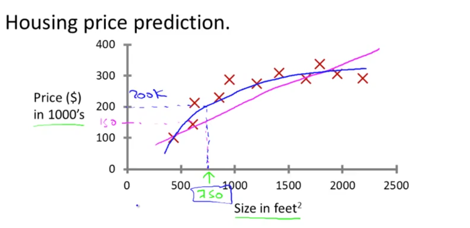
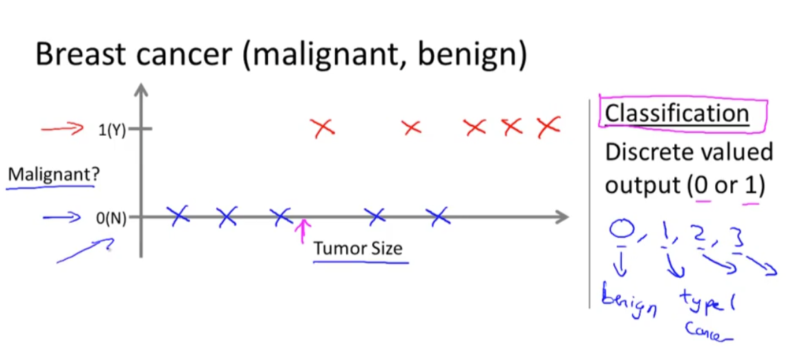

---

### 🏡 **Housing Price Prediction — Explained**

This image illustrates a **regression problem** in **supervised learning**, where the goal is to predict the **price of a house** based on its **size in square feet**.

#### 📈 Graph Breakdown:

* **X-axis (horizontal):** Size of the house (in square feet).
* **Y-axis (vertical):** Price of the house (in \$1,000s).

  * For example, 200 on the Y-axis means \$200,000.

#### 🟧 Data Points:

* The **red X marks** represent actual historical data: houses of certain sizes with known prices.

#### 📉 Curves:

* **Blue Curve:** Likely a polynomial regression fit that captures the nonlinear trend in the data.
* **Pink Line:** Possibly a linear regression model — it does not curve, and may not fit the data well (could underfit).

#### 🔍 Example Highlight:

* For a house size of **750 square feet**, the predicted price from the blue curve is approximately **\$200,000**, and from the pink line it's around **\$150,000**.
* This comparison shows how **model complexity** affects prediction accuracy — the nonlinear model (blue) better matches the data.

---

### 🧠 Machine Learning Context

* **Supervised Learning:** The model is trained on labeled data (house size → price).
* **Regression:** The task is to predict a **continuous output** (house price).

---

This type of visualization helps in understanding how different models (linear vs nonlinear) can impact prediction accuracy in real-world problems like housing price estimation.

This image is a visual explanation of a **classification problem** in machine learning, specifically for **breast cancer diagnosis** (malignant vs. benign tumors).

---

### 🩺 **Breast Cancer Classification — Explained**

#### 📊 Graph Overview:

* **X-axis:** Tumor size.
* **Y-axis:** Output label (classification):

  * `0 (N)` → Not malignant (benign)
  * `1 (Y)` → Malignant (cancerous)

#### 🔵 Blue Crosses:

* Represent tumors that are **benign** (label = 0).
* These tumors have smaller sizes, based on the left side of the x-axis.

#### 🔴 Red Crosses:

* Represent **malignant** tumors (label = 1).
* Typically found with larger tumor sizes.

#### 🎯 Classification Boundary:

* There's an implied threshold tumor size (marked by a pink arrow) — to the left of it, tumors are classified as benign, and to the right, as malignant.

---

### 🧠 Machine Learning Context

#### 🔍 Classification Task:

* Unlike regression (continuous output), classification deals with **discrete-valued outputs**.
* In this case: **binary classification** (`0` or `1`).
* But classification can also extend to **multi-class outputs** (e.g., `0`, `1`, `2`, `3`) as shown in the hand-drawn note at the bottom-right (like for different cancer types).

#### ✅ Supervised Learning:

* The model learns from labeled examples: tumor size → label (malignant or not).

---

### 💡 Key Takeaways:

* **Input:** Tumor size (a continuous feature).
* **Output:** Class label (benign or malignant).
* **Goal:** Train a classifier to predict whether a tumor is malignant based on size.
