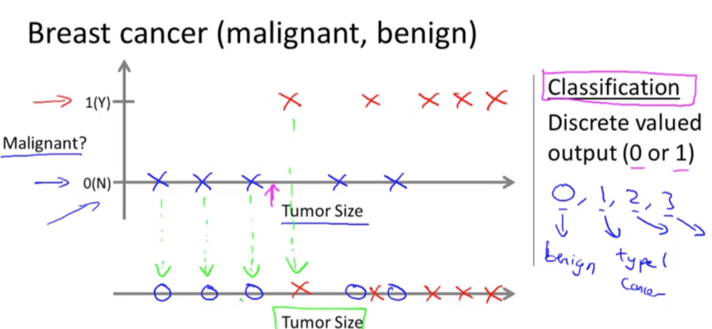
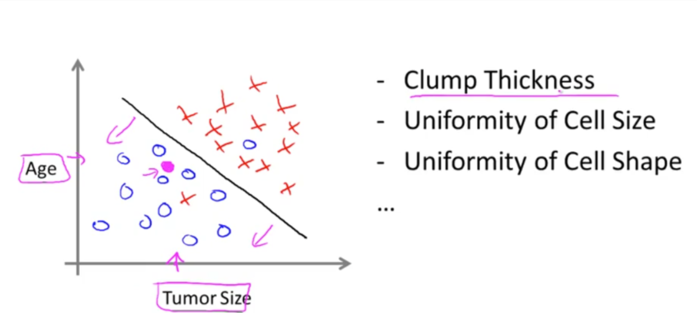
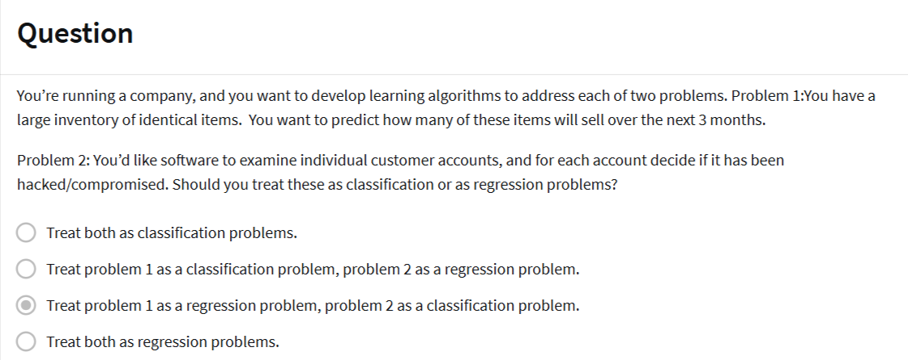

# Supervised Learning

In supervised learning, we are given a data set and already know what our correct output should look like, having the idea that there is a relationship between the input and the output.

Supervised learning problems are categorized into "regression" and "classification" problems. In a regression problem, we are trying to predict results within a continuous output, meaning that we are trying to map input variables to some continuous function. In a classification problem, we are instead trying to predict results in a discrete output. In other words, we are trying to map input variables into discrete categories. 

--- 

---

### 🏡 **Housing Price Prediction — Explained**

This image illustrates a **regression problem** in **supervised learning**, where the goal is to predict the **price of a house** based on its **size in square feet**.

#### 📈 Graph Breakdown:

* **X-axis (horizontal):** Size of the house (in square feet).
* **Y-axis (vertical):** Price of the house (in \$1,000s).

  * For example, 200 on the Y-axis means \$200,000.

#### 🟧 Data Points:

* The **red X marks** represent actual historical data: houses of certain sizes with known prices.

#### 📉 Curves:

* **Blue Curve:** Likely a polynomial regression fit that captures the nonlinear trend in the data.
* **Pink Line:** Possibly a linear regression model — it does not curve, and may not fit the data well (could underfit).

#### 🔍 Example Highlight:

* For a house size of **750 square feet**, the predicted price from the blue curve is approximately **\$200,000**, and from the pink line it's around **\$150,000**.
* This comparison shows how **model complexity** affects prediction accuracy — the nonlinear model (blue) better matches the data.

---

### 🧠 Machine Learning Context

* **Supervised Learning:** The model is trained on labeled data (house size → price).
* **Regression:** The task is to predict a **continuous output** (house price).

---

This type of visualization helps in understanding how different models (linear vs nonlinear) can impact prediction accuracy in real-world problems like housing price estimation.

This image is a visual explanation of a **classification problem** in machine learning, specifically for **breast cancer diagnosis** (malignant vs. benign tumors).

---

### 🩺 **Breast Cancer Classification — Explained**

#### 📊 Graph Overview:

* **X-axis:** Tumor size.
* **Y-axis:** Output label (classification):

  * `0 (N)` → Not malignant (benign)
  * `1 (Y)` → Malignant (cancerous)

#### 🔵 Blue Crosses:

* Represent tumors that are **benign** (label = 0).
* These tumors have smaller sizes, based on the left side of the x-axis.

#### 🔴 Red Crosses:

* Represent **malignant** tumors (label = 1).
* Typically found with larger tumor sizes.

#### 🎯 Classification Boundary:

* There's an implied threshold tumor size (marked by a pink arrow) — to the left of it, tumors are classified as benign, and to the right, as malignant.

---

### 🧠 Machine Learning Context

#### 🔍 Classification Task:

* Unlike regression (continuous output), classification deals with **discrete-valued outputs**.
* In this case: **binary classification** (`0` or `1`).
* But classification can also extend to **multi-class outputs** (e.g., `0`, `1`, `2`, `3`) as shown in the hand-drawn note at the bottom-right (like for different cancer types).

#### ✅ Supervised Learning:

* The model learns from labeled examples: tumor size → label (malignant or not).

---

### 💡 Key Takeaways:

* **Input:** Tumor size (a continuous feature).
* **Output:** Class label (benign or malignant).
* **Goal:** Train a classifier to predict whether a tumor is malignant based on size.

This updated image provides a more detailed explanation of the **classification process in supervised learning**, specifically applied to **breast cancer diagnosis**.

---

### 🧬 **Breast Cancer Classification – Enhanced Explanation**

#### 🎯 Objective:

Predict whether a tumor is **malignant (1)** or **benign (0)** based on its **size** using a classification model.

---

### 🔍 Graph Components:

#### **Top Graph**:

* **X-axis:** Tumor Size
* **Y-axis:** Classification Output

  * `0 (N)` = **Benign**
  * `1 (Y)` = **Malignant**
* **Red Xs:** Malignant cases (label = 1)
* **Blue Xs:** Benign cases (label = 0)
* **Pink Arrow:** Indicates a threshold tumor size, used to decide the class boundary.

#### **Bottom Graph**:

* Visualizes **new/test tumor sizes** (represented as blue circles) being evaluated.
* **Green dashed arrows** show how these new tumor instances are classified based on size.

  * Small tumors → classified as benign (left side)
  * Large tumors → classified as malignant (right side)

---

### 🧠 Classification Concepts (Right Panel):

* **Classification** = Predicting **discrete-valued outputs**

  * Binary: `0` or `1`
  * Multi-class: `0`, `1`, `2`, `3`, etc.

    * E.g., `0 = benign`, `1 = type-1 cancer`, `2 = type-2 cancer`, etc.
* **Supervised Learning:** Uses labeled data to train the model (tumor size → label)

---

### ✅ Summary:

* **Input:** Tumor Size (continuous feature)
* **Output:** Class Label (discrete – 0 or 1)
* **Goal:** Learn a boundary to correctly classify unseen tumor data.
* The image simulates how predictions are made and highlights the **importance of decision boundaries** in classification tasks.

---

This image illustrates the concept of **classification in machine learning using multiple features** to distinguish between two classes—most likely **benign vs. malignant tumors**—in a breast cancer diagnosis context.

---

### 🧠 **Multivariate Classification — Explained**

#### 📊 Graph Details:

* **X-axis:** Tumor Size
* **Y-axis:** Age
* **Blue Circles (⭕):** One class (likely **benign**)
* **Red Crosses (❌):** Another class (likely **malignant**)

#### ⚫ Black Line:

* A **decision boundary** learned by the classifier to separate the two classes based on the input features (Age and Tumor Size).
* Points to the **left and below** the line → classified as blue class (benign).
* Points to the **right and above** the line → classified as red class (malignant).

#### 🟣 Purple Dot:

* A test or new data point to be classified. Its position relative to the decision boundary will determine its predicted label.

---

### 🧬 Features in Breast Cancer Diagnosis:

On the right side of the image, we see a list of **other potential features** used in real-world cancer classification tasks:

* **Clump Thickness**
* **Uniformity of Cell Size**
* **Uniformity of Cell Shape**
* ... (indicating more features like Bare Nuclei, Mitoses, etc.)

These features are often extracted from medical imaging or biopsy data and form the **feature vector** used for model training.

---

### 🧾 Summary:

* This is a **binary classification problem** with **multivariate inputs**.
* The **goal** is to find a boundary in the multidimensional space that best separates the two classes.
* This type of setup is common in models like **logistic regression**, **support vector machines (SVMs)**, or **decision trees**.

---

Here's the explanation of the multiple-choice question shown in the image:

---

### 🧠 **Classification vs. Regression: Understanding the Problem Types**

#### 🧾 Question Breakdown:

You're given **two problems** and need to decide whether each should be handled as a **classification** or **regression** task.

---

### 🟨 **Problem 1: Inventory Sales Forecasting**

> *"You have a large inventory of identical items. You want to predict how many of these items will sell over the next 3 months."*

* 🔍 **Nature of output:** A **numerical value** (e.g., 127 units sold).
* ✅ **Type of problem:** **Regression**

  * Because you're predicting a **continuous quantity**.

---

### 🟩 **Problem 2: Customer Account Compromise Detection**

> *"Examine individual customer accounts and decide if each has been hacked/compromised."*

* 🔍 **Nature of output:** A **label** or **category** (e.g., "compromised" or "not compromised").
* ✅ **Type of problem:** **Classification**

  * Because the goal is to assign each input (account) to one of **discrete classes** (e.g., 0 or 1).

---

### ✅ **Correct Answer:**

> **"Treat problem 1 as a regression problem, problem 2 as a classification problem."**

This is the correct approach because:

* Problem 1 deals with **quantitative prediction** → **Regression**.
* Problem 2 deals with **categorical classification** → **Classification**.

---
