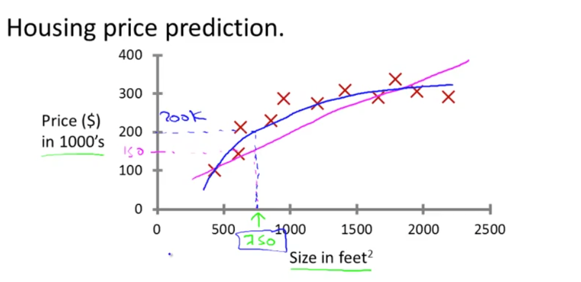

---

### 🏡 **Housing Price Prediction — Explained**

This image illustrates a **regression problem** in **supervised learning**, where the goal is to predict the **price of a house** based on its **size in square feet**.

#### 📈 Graph Breakdown:

* **X-axis (horizontal):** Size of the house (in square feet).
* **Y-axis (vertical):** Price of the house (in \$1,000s).

  * For example, 200 on the Y-axis means \$200,000.

#### 🟧 Data Points:

* The **red X marks** represent actual historical data: houses of certain sizes with known prices.

#### 📉 Curves:

* **Blue Curve:** Likely a polynomial regression fit that captures the nonlinear trend in the data.
* **Pink Line:** Possibly a linear regression model — it does not curve, and may not fit the data well (could underfit).

#### 🔍 Example Highlight:

* For a house size of **750 square feet**, the predicted price from the blue curve is approximately **\$200,000**, and from the pink line it's around **\$150,000**.
* This comparison shows how **model complexity** affects prediction accuracy — the nonlinear model (blue) better matches the data.

---

### 🧠 Machine Learning Context

* **Supervised Learning:** The model is trained on labeled data (house size → price).
* **Regression:** The task is to predict a **continuous output** (house price).

---

This type of visualization helps in understanding how different models (linear vs nonlinear) can impact prediction accuracy in real-world problems like housing price estimation. Let me know if you’d like this translated into a Markdown cell for a notebook or for a README section!
